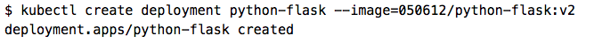
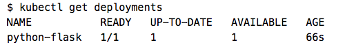
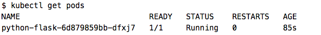
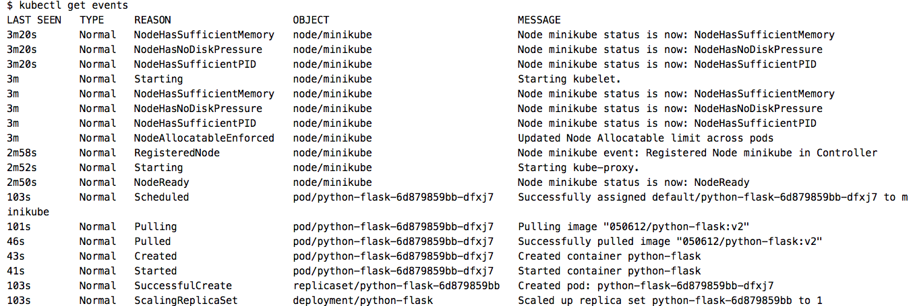
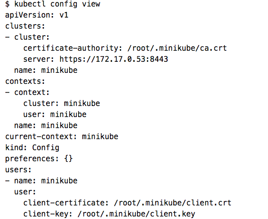
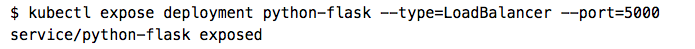
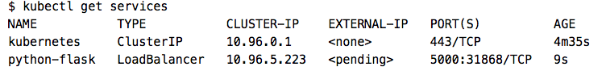
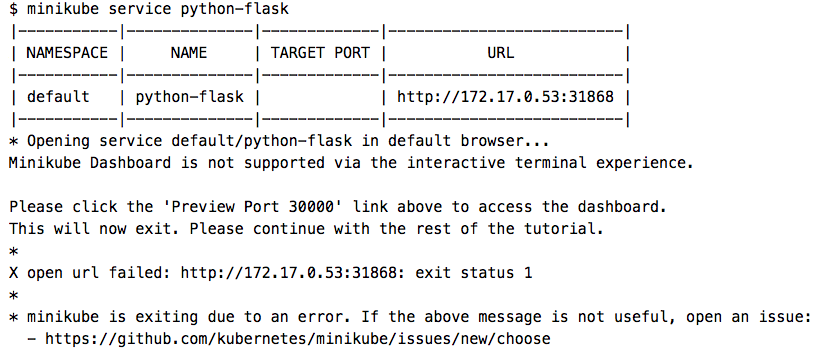
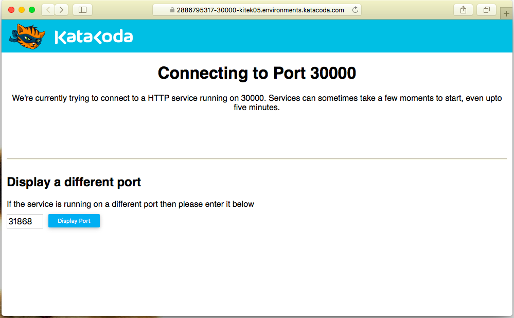
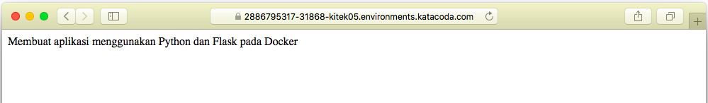

# KUBERNETES

# Membuat Deployment dengan Python+Flask

1. `kubectl create` perintah ini digunakan untuk membuat sebuah Deployment untuk memanage atau mengatur sebuah Pod.
    Dimana Pod menjalankan Container berdasarkan pada images Docker yang disediakan. Yang mana `python-flask:v2` adalah images Docker dan `050612` adalah akun DockerHub saya. Sebelumnya images Docker `python-flask:v2` ini dibuat dan dipush ke DockerHub pada saat praktikum tcc minggu-08.
    

2. `kubectl get deployments` perintah ini digunakan untuk melihat Deployment yang sudah berhasil dibuat,
   dan hasilnya seperti berikut :
   

3. `kubectl get pods` perintah ini digunakan untuk melihat Pod yang sudah berhasil dibuat, dan hasilnya seperti berikut :
   

4. `kubectl get events` perintah ini digunakan untuk melihat event yang terjadi pada cluster,
   dan hasilnya seperti berikut :
   

5. `kubectl config view` perintah ini digunakan untuk melihat konfigurasi kubectl, dan hasilnya seperti berikut :
   

# Membuat Service

Mengekspos Pod sebagai Layanan Kubernetes (Service Kubernetes) digunakan untuk membuat python-flask Container dapat diakses dari luar jaringan virtual Kubernetes. Karena secara default, Pod hanya dapat diakses oleh alamat IP (IP Address) internal di dalam cluster Kubernetes.

1. `kubectl expose` perintah ini digunakan untuk mengekspos Pod ke internet public,
    sedangkan flags `--type=LoadBalancer` menunjukkan bahwa saya ingin mengekspos Layanan (Service) saya di luar cluster.
    

2. `kubectl get services` perintah ini digunakan untuk melihat Layanan (Service) yang baru saja saya buat.
   

3. Pada penyedia cloud yang mendukung penyeimbang beban (LoadBalancer),
   alamat IP (IP Address) eksternal akan disediakan untuk mengakses Layanan (Service). Di Minikube, tipe LoadBalancer membuat Layanan (Service) dapat diakses melalui perintah `minikube service`.
   

4. `minikube service python-flask` pada perintah ini terlihat bahwa untuk mengakses pada browser menggunakan port 31868.
    Maka ubah port pada Katacoda yang sebelumnya 30000 menjadi port 31868.
    

5.  Setalah mengubah port yang sesuai kemudian klik Display Port pada Katacoda,
    maka akan muncul isi dari images docker `python-flask:v2`
    
